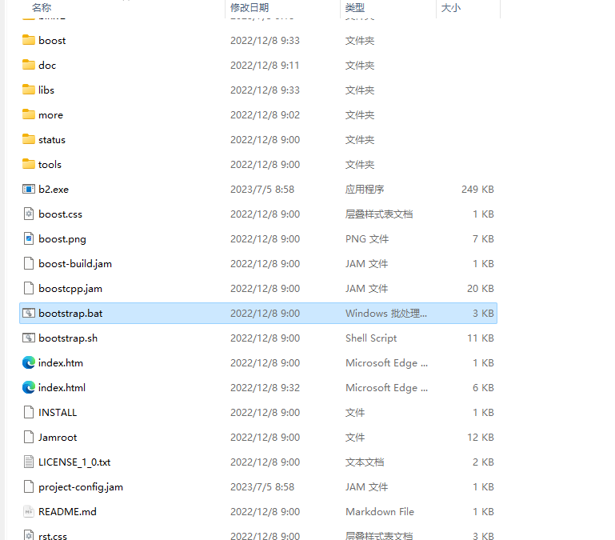
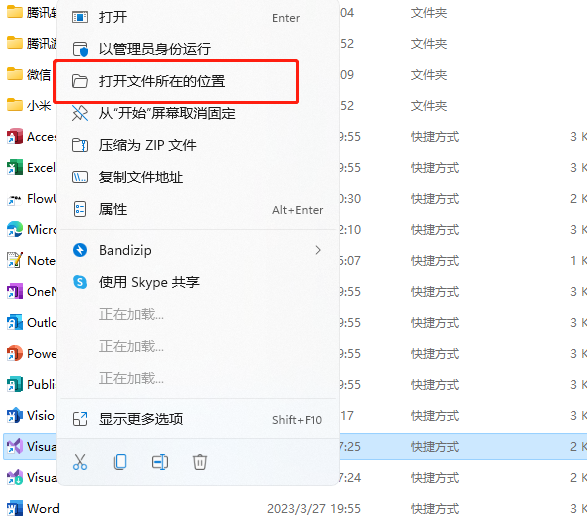
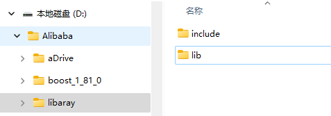
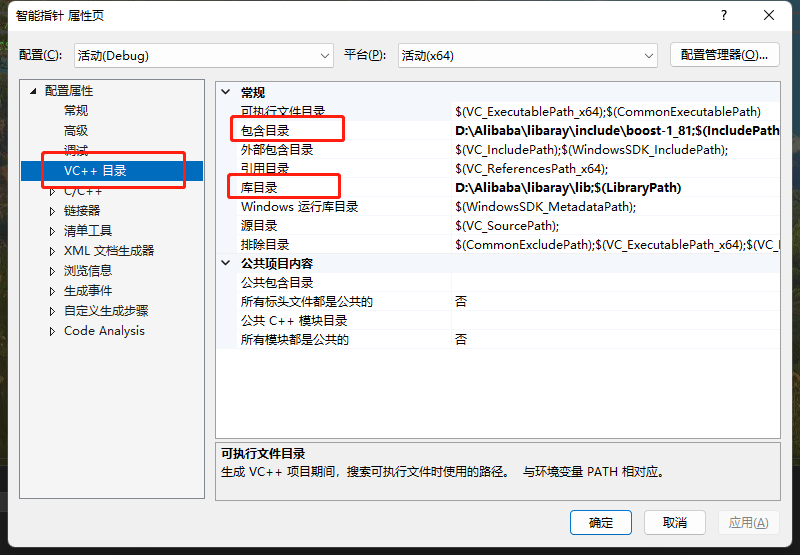
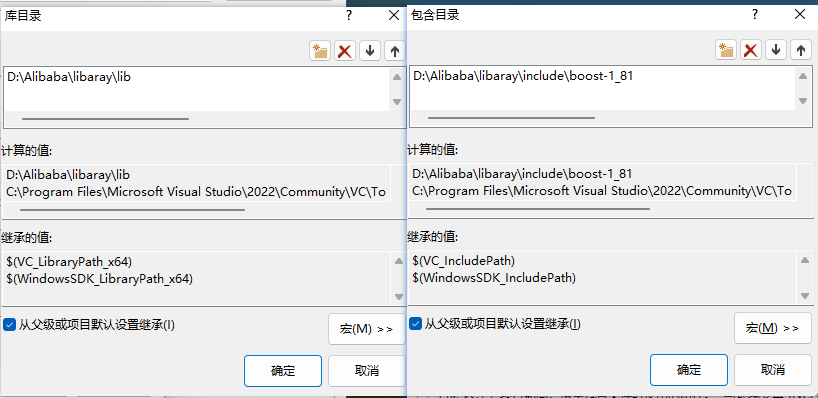
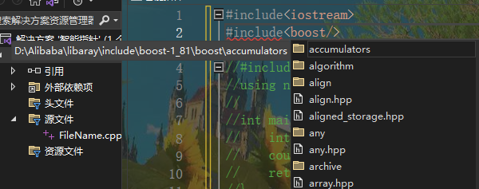

BOOST库配置到VS2022（保姆级教程）

1.下载boost，根据自身需求下载，我用的是1.81 下载地址
2.解压


运行booststrap.bat 生成b2.exe

3.查看MSVC版本

先找到VS的环境目录
你不知道怎么找？ 好 喂给你

右键VS2022快捷方式

现在是在IDE这个目录里

目标在这里

我的MSVC是14.3

4.生成include和lib文件

用vs自带的命令行运行以下命令（过程非常缓慢，得等一会儿）
MSVC要改成自己的版本

```shell 
b2 install --toolset=msvc-14.3 --build-type=complete --prefix=“要存储boost的include和lib的文件夹路径（可自行创建）” link=shared runtime-link=shared runtime-link=static threading=multi debug release
```
找不到的可以在开始菜单中看看


安装完成



5.使用
右键 --> 项目 --> 属性 --> VC++目录
对以下两项做一下更改即可食用



这详细的是路径选择



OK


————————————————

                            版权声明：本文为博主原创文章，遵循 CC 4.0 BY-SA 版权协议，转载请附上原文出处链接和本声明。

原文链接：https://blog.csdn.net/m0_53889456/article/details/131548460